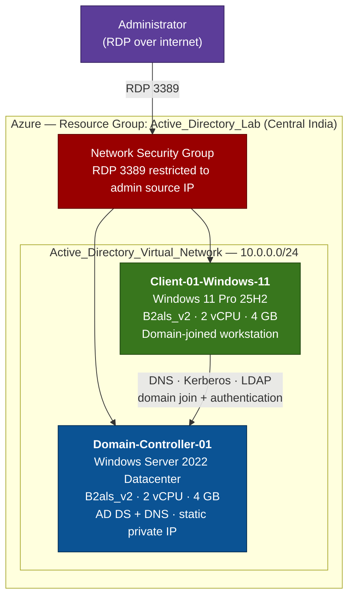
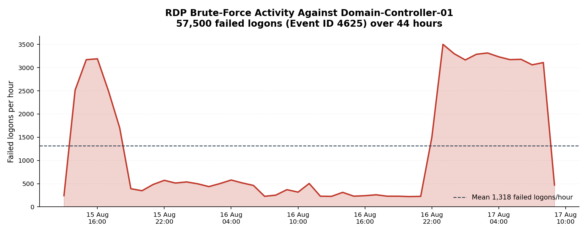

# Cloud-Based Active Directory Setup and User Management

Building a functioning Active Directory domain from scratch on Microsoft Azure, joining a Windows 11 workstation to it, provisioning users, and analysing the Windows Security log events those actions generate.

This is a hands-on lab focused on the SOC analyst's view of Active Directory: not just *how* to build a domain, but *what it looks like in the logs* when someone does.

---

## Architecture



The critical design constraint: **both VMs sit in the same virtual network and region.** Without that, the domain join fails — there is no DNS resolution or Kerberos path between the client and the domain controller.

---

## Lab Environment

| Component | Name | Configuration |
|---|---|---|
| Resource Group | `Active_Directory_Lab` | Region: Central India |
| Virtual Network | `Active_Directory_Virtual_Network` | Subnet: default (10.0.0.0/24) |
| Domain Controller | `Domain-Controller-01` | Windows Server 2022 Datacenter, B2als_v2 (2 vCPU / 4 GB), static private IP |
| Client Workstation | `Client-01-Windows-11` | Windows 11 Pro 25H2, B2als_v2 (2 vCPU / 4 GB) |
| Forest / Domain | `corp.corp-local.com` | Forest and domain functional level: Windows Server 2022 |
| Domain Admin | `corp\tanmay_admin` | Used for all administrative tasks |
| Test Users | `alice`, `bob`, `charlie` | Created in the `TestUsers` organizational unit |

**Cost note:** B2als_v2 was selected over B2s/B2as deliberately — roughly $17.96/month compute versus a materially higher figure for the alternatives, which matters on a free-tier subscription with a fixed credit. Total run cost per VM including OS disk and public IP came to approximately $41/month; both VMs were deallocated when not in use to conserve credit.

---

## What I Built

| # | Stage | Outcome |
|---|---|---|
| A–D | Azure foundation | Resource group and virtual network provisioned |
| 1 | Provision VMs | Two Windows VMs deployed into a shared VNet |
| 2 | Configure Domain Controller | AD DS role installed, server promoted to DC, new forest `corp.corp-local.com` created with integrated DNS |
| 3 | Join client to domain | Client DNS repointed to the DC, workstation joined to `corp.corp-local.com`, membership verified via `whoami` |
| 4 | Users and OUs | `TestUsers` OU created; `alice`, `bob`, `charlie` provisioned and added to Domain Users |
| 5 | Access management | Password reset performed; `corp\alice` granted membership of the local Remote Desktop Users group |
| 5b | Account lifecycle | `charlie` disabled then deleted; `bob` added to and removed from the built-in Administrators group — exercising the full joiner-mover-leaver path and the privileged-group changes that accompany it |
| 6 | Test authentication | Logged in as `corp\alice`, verified identity, reached the DC over SMB and ICMP |
| 7 | Monitoring | Security log reviewed and filtered by Event ID; events correlated to lab actions; log exported to `DC01-SecurityLogs.evtx` |
| — | Azure-native security | Microsoft Defender for Cloud posture review; NSG hardened to restrict RDP by source IP |

---

## Security Events Observed

Every administrative action in Active Directory leaves a trace. These are the events captured on `Domain-Controller-01` and mapped back to the actions that produced them.

### Authentication

| Event ID | Description | SOC Relevance |
|---|---|---|
| 4624 | Successful logon | Confirms valid user authentication |
| 4625 | Failed logon | Detects brute-force or password guessing |
| 4648 | Logon using explicit credentials | Indicates lateral movement attempts |

### Account Management

| Event ID | Description | SOC Relevance |
|---|---|---|
| 4720 | User account created | Tracks user provisioning |
| 4722 | User account enabled | Detects reactivated accounts |
| 4723 / 4724 | Password change / reset | Monitors credential changes |
| 4725 | User account disabled | Tracks access revocation |
| 4726 | User account deleted | Identifies account removal |

### Domain and Group Changes

| Event ID | Description | SOC Relevance |
|---|---|---|
| 4732 | User added to a security group | Privilege escalation monitoring |
| 4733 | User removed from a security group | Access change tracking |
| 4735 | Security group modified | Detects group tampering |

### Correlating Events to Actions

| Lab action performed | Event generated |
|---|---|
| `alice` logs in to the client | 4624 |
| Administrator resets `alice`'s password | 4724 |
| Privileged account logs on | 4672 |
| Group membership enumerated at logon | 4627 |
| Process launched (`cmd.exe`, `whoami`) | 4688 |
| Scheduled task updated | 4702 |

> **Event IDs are not perfectly portable.** The same action can surface different IDs depending on Windows Server version, client OS, domain functional level, and audit policy configuration. 4624/4625 appear on both the client and the DC but with different Logon Types. A password change initiated by the user logs 4723; the same change performed by an administrator logs 4724. Knowing *why* an expected event is missing is as much a part of the job as finding it.

---

## Problems Hit and How They Were Solved

| Problem | Root cause | Resolution |
|---|---|---|
| Client could not find the `corp.corp-local.com` domain during join | The client VM was using Azure's default DNS, which has no record of the private domain | Manually set the client's preferred DNS server to the domain controller's **private** IP before attempting the join |
| `alice` could not complete first login | The account was created with *User must change password at next logon*, which cannot be satisfied cleanly over an RDP session to a domain-joined client | Reset the password from ADUC with that option unchecked |
| `alice` denied RDP access to the client VM after a valid domain login | Being a Domain User grants authentication, not interactive remote access — that is a separate local right | Added `corp\alice` to the client's local **Remote Desktop Users** group via `sysdm.cpl` → Remote → Select Users |
| RDP (3389) reachable from the entire internet by default | The VM creation wizard opens 3389 to `Any` source, which is how domain controllers get brute-forced | Edited the NSG inbound rule to scope the source to a single administrative IP address — see the finding below, this was not hypothetical |

---

## Unplanned Finding: The Lab Was Attacked

The exported Security log was not supposed to be the interesting part of this project. It turned out to be.

While reviewing the log, the number of Event ID 4625 (failed logon) records was far higher than the lab itself could explain. A few failed logons would be expected from mistyped passwords during testing. There were tens of thousands.

| Metric | Value |
|---|---|
| Failed logons (Event ID 4625) | **57,500** |
| Successful logons (4624) | 7,830 |
| Failed-to-successful ratio | **7.3 : 1** |
| Observation window | 43.6 hours (15 Aug 13:32 – 17 Aug 09:09) |
| Mean rate | **1,318 per hour** (~22 per minute) |
| Peak hour | 16 Aug 23:00 — **3,501** failed logons |
| Hours with attack traffic | **45 of 45** — continuous, no gaps |



Two concentrated bursts sit on top of a persistent 200–600/hour baseline that never stops. That shape is characteristic of automated tooling: the baseline is opportunistic internet-wide scanning, the peaks are dictionary runs against this host once it had been identified as reachable.

**Root cause.** The Azure VM wizard opens inbound RDP (3389) with the source set to `Any`, and that default was accepted so the lab could be reached remotely. Nothing about this environment was published anywhere — scanners found it independently, and traffic began within hours of deployment. Scoping the NSG rule to a single administrative IP stopped it.

### Secondary finding: the attack destroyed evidence

The Windows Security log has a fixed maximum size and overwrites its oldest records when full. 57,500 junk records in under two days consumed that capacity.

The consequence is visible in the export: the oldest surviving record is from 15 August, though the environment was built and the test accounts provisioned several days earlier. Event ID **4723** is absent entirely and only a single **4720** survives — despite the Step 4 screenshots showing those events at the time the accounts were created. The evidence exists in the screenshots but no longer in the log.

A high-volume attack is also a log-retention attack. The noise can push evidence of an earlier, quieter intrusion out of the log before anyone reviews it — which is the practical argument for increasing Security log size, forwarding to a SIEM in near real time, or both, rather than treating local `.evtx` files as a system of record.

---

## Skills Demonstrated

- **Cloud infrastructure** — Azure resource groups, virtual networks, subnets, VM sizing and cost control, network security groups
- **Windows Server administration** — AD DS role installation, domain controller promotion, forest and DNS configuration, DSRM
- **Identity and access management** — organizational unit design, user provisioning, group membership, password policy, least-privilege remote access
- **Security monitoring** — Windows Security log analysis, Event ID filtering and correlation, evidence export to `.evtx` and CSV for SIEM ingestion
- **Incident analysis** — identified and quantified a live RDP brute-force campaign from log data (57,500 failed logons over 44 hours), determined root cause, and remediated at the network layer
- **PowerShell** — parsed and filtered an 81,000-event Security log with `Get-WinEvent`, exporting a scoped dataset for analysis
- **Cloud security posture** — Microsoft Defender for Cloud recommendations, attack surface reduction through network-level access control
- **Troubleshooting** — DNS resolution failures, domain join errors, authentication versus authorization distinctions

---

## Repository Contents

```
.
├── README.md
├── docs/
│   ├── AD-Lab-Walkthrough.pdf           # full walkthrough, 224 annotated screenshots
│   ├── AD-Lab-Walkthrough.docx          # editable source
│   └── bruteforce-timeline.png          # attack volume chart
├── logs/
│   └── DC01-Security-Log-Analysis.xlsx  # event summary, notable events, hourly attack data
└── scripts/
    └── Export-SecurityEvents.ps1        # extracts and filters events from the .evtx
```

The walkthrough documents every step with annotated screenshots — from resource group creation through to Security log analysis and the incident write-up in Step 8. Start with the PDF; GitHub will not preview the `.docx`.

The workbook has four tabs: a summary of the findings, every Event ID with counts, all 207 account and group events in time order, and the hourly attack data behind the chart above.

---

## Notes

- The forest root domain is `corp.corp-local.com` — a subdomain of a routable parent, rather than the `.local` suffix commonly used in tutorials. This was deliberate: Microsoft advises against `.local` domains because the suffix is reserved for multicast DNS (mDNS/Bonjour), which causes name resolution conflicts on macOS and Linux clients. Production deployments should follow the same pattern used here.
- The NetBIOS domain name is `CORP`, which is why logons take the form `corp\username` regardless of the longer DNS name.
- Azure account creation and portal sign-in are not documented here, as those screens contain personal billing and identity information.
- All accounts and credentials shown belong to a throwaway lab environment built solely for this project. Subscription identifiers, tenant identifiers, account email addresses and public IP addresses have been redacted from the screenshots, and no IP addresses, usernames or email addresses appear in the exported log data.

---

*Built as a self-directed lab to develop practical SOC, identity and Windows security skills.*
