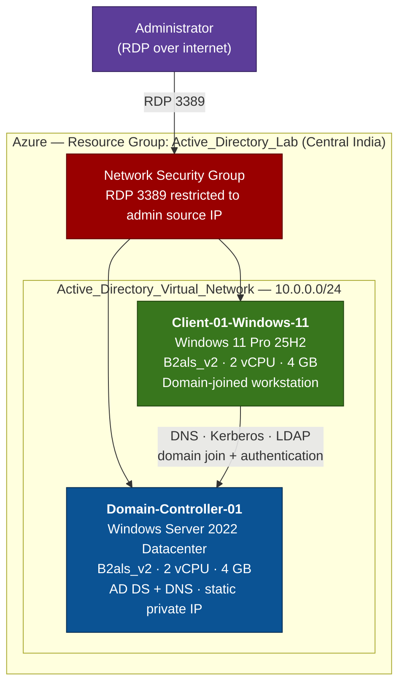

# Cloud-Based Active Directory Setup and User Management

Building a functioning Active Directory domain from scratch on Microsoft Azure, joining a Windows 11 workstation to it, provisioning users, and analysing the Windows Security log events those actions generate.

This is a hands-on lab focused on the SOC analyst's view of Active Directory: not just *how* to build a domain, but *what it looks like in the logs* when someone does.

---

## Architecture



The critical design constraint: **both VMs sit in the same virtual network and region.** Without that, the domain join fails — there is no DNS resolution or Kerberos path between the client and the domain controller.

---

## Lab Environment

| Component | Name | Configuration |
|---|---|---|
| Resource Group | `Active_Directory_Lab` | Region: Central India |
| Virtual Network | `Active_Directory_Virtual_Network` | Subnet: default (10.0.0.0/24) |
| Domain Controller | `Domain-Controller-01` | Windows Server 2022 Datacenter, B2als_v2 (2 vCPU / 4 GB), static private IP |
| Client Workstation | `Client-01-Windows-11` | Windows 11 Pro 25H2, B2als_v2 (2 vCPU / 4 GB) |
| Forest / Domain | `corp.corp-local.com` | Forest and domain functional level: Windows Server 2022 |
| Domain Admin | `corp\tanmay_admin` | Used for all administrative tasks |
| Test Users | `alice`, `bob`, `charlie` | Created in the `TestUsers` organizational unit |

**Cost note:** B2als_v2 was selected over B2s/B2as deliberately — roughly $17.96/month compute versus a materially higher figure for the alternatives, which matters on a free-tier subscription with a fixed credit. Total run cost per VM including OS disk and public IP came to approximately $41/month; both VMs were deallocated when not in use to conserve credit.

---

## What I Built

| # | Stage | Outcome |
|---|---|---|
| A–D | Azure foundation | Resource group and virtual network provisioned |
| 1 | Provision VMs | Two Windows VMs deployed into a shared VNet |
| 2 | Configure Domain Controller | AD DS role installed, server promoted to DC, new forest `corp.corp-local.com` created with integrated DNS |
| 3 | Join client to domain | Client DNS repointed to the DC, workstation joined to `corp.corp-local.com`, membership verified via `whoami` |
| 4 | Users and OUs | `TestUsers` OU created; `alice`, `bob`, `charlie` provisioned and added to Domain Users |
| 5 | Access management | Password reset performed; `corp\alice` granted membership of the local Remote Desktop Users group |
| 5b | Account lifecycle | `charlie` disabled then deleted; `bob` added to and removed from the built-in Administrators group — exercising the full joiner-mover-leaver path and the privileged-group changes that accompany it |
| 6 | Test authentication | Logged in as `corp\alice`, verified identity, reached the DC over SMB and ICMP |
| 7 | Monitoring | Security log reviewed and filtered by Event ID; events correlated to lab actions; log exported to `DC01-SecurityLogs.evtx` |
| — | Azure-native security | Microsoft Defender for Cloud posture review; NSG hardened to restrict RDP by source IP |

---

## Security Events Observed

Every administrative action in Active Directory leaves a trace. These are the events captured on `Domain-Controller-01` and mapped back to the actions that produced them.

### Authentication

| Event ID | Description | SOC Relevance |
|---|---|---|
| 4624 | Successful logon | Confirms valid user authentication |
| 4625 | Failed logon | Detects brute-force or password guessing |
| 4648 | Logon using explicit credentials | Indicates lateral movement attempts |

### Account Management

| Event ID | Description | SOC Relevance |
|---|---|---|
| 4720 | User account created | Tracks user provisioning |
| 4722 | User account enabled | Detects reactivated accounts |
| 4723 / 4724 | Password change / reset | Monitors credential changes |
| 4725 | User account disabled | Tracks access revocation |
| 4726 | User account deleted | Identifies account removal |

### Domain and Group Changes

| Event ID | Description | SOC Relevance |
|---|---|---|
| 4732 | User added to a security group | Privilege escalation monitoring |
| 4733 | User removed from a security group | Access change tracking |
| 4735 | Security group modified | Detects group tampering |

### Correlating Events to Actions

| Lab action performed | Event generated |
|---|---|
| `alice` logs in to the client | 4624 |
| Administrator resets `alice`'s password | 4724 |
| Privileged account logs on | 4672 |
| Group membership enumerated at logon | 4627 |
| Process launched (`cmd.exe`, `whoami`) | 4688 |
| Scheduled task updated | 4702 |

> **Event IDs are not perfectly portable.** The same action can surface different IDs depending on Windows Server version, client OS, domain functional level, and audit policy configuration. 4624/4625 appear on both the client and the DC but with different Logon Types. A password change initiated by the user logs 4723; the same change performed by an administrator logs 4724. Knowing *why* an expected event is missing is as much a part of the job as finding it.

---

## Problems Hit and How They Were Solved

| Problem | Root cause | Resolution |
|---|---|---|
| Client could not find the `corp.corp-local.com` domain during join | The client VM was using Azure's default DNS, which has no record of the private domain | Manually set the client's preferred DNS server to the domain controller's **private** IP before attempting the join |
| `alice` could not complete first login | The account was created with *User must change password at next logon*, which cannot be satisfied cleanly over an RDP session to a domain-joined client | Reset the password from ADUC with that option unchecked |
| `alice` denied RDP access to the client VM after a valid domain login | Being a Domain User grants authentication, not interactive remote access — that is a separate local right | Added `corp\alice` to the client's local **Remote Desktop Users** group via `sysdm.cpl` → Remote → Select Users |
| RDP (3389) reachable from the entire internet by default | The VM creation wizard opens 3389 to `Any` source, which is how domain controllers get brute-forced | Edited the NSG inbound rule to scope the source to a single administrative IP address — see the finding below, this was not hypothetical |

---

## Unplanned Finding: The Lab Was Attacked

The exported Security log was not supposed to be the interesting part of this project. It turned out to be.

Between **14 August 22:29** and **17 August 04:16** — a 54-hour window — the domain controller recorded:

| Metric | Value |
|---|---|
| Failed logons (Event ID 4625) | **49,853** |
| Successful logons (4624) | 9,629 |
| Failed-to-successful ratio | **5.2 : 1** |
| Sustained rate | **927 per hour** (15.4 per minute) |
| Hours with attack traffic | **55 of 55** — continuous, no gaps |

This is an automated credential-guessing campaign against RDP, and it began within hours of the VM being created with port 3389 open to `Any` source — the default the Azure VM wizard offers. No one advertised this host. Internet-wide scanners found it on their own.

**Two things follow from this that no tutorial teaches:**

**1. Exposure is not theoretical.** The gap between "3389 is open to the internet" and "something is actively trying to break in" was measured in hours, not weeks. Restricting the NSG source to a single administrative IP stopped it.

**2. The attack destroyed evidence.** The Security log has a fixed maximum size and wraps when full. 49,853 junk events in 54 hours filled it, and the earlier records were evicted — which is why `4720` (user account created) and `4723` (password change) appear in the walkthrough screenshots but are **absent from the exported log**. The accounts were provisioned before 14 August; those events no longer exist on disk.

That second point is a real operational lesson. A high-volume attack is also a log-retention attack: it can push the evidence of an earlier, quieter intrusion out of the log entirely. In production the mitigations are to increase the Security log size, forward events to a SIEM in near-real time, or both — which is precisely why organisations centralise logging rather than relying on local `.evtx` files.

---

## Skills Demonstrated

- **Cloud infrastructure** — Azure resource groups, virtual networks, subnets, VM sizing and cost control, network security groups
- **Windows Server administration** — AD DS role installation, domain controller promotion, forest and DNS configuration, DSRM
- **Identity and access management** — organizational unit design, user provisioning, group membership, password policy, least-privilege remote access
- **Security monitoring** — Windows Security log analysis, Event ID filtering and correlation, evidence export to `.evtx` and CSV for SIEM ingestion
- **Incident analysis** — identified and quantified a live RDP brute-force campaign from log data (~50,000 failed logons over 54 hours), determined root cause, and remediated at the network layer
- **PowerShell** — parsed and filtered a 79,000-event Security log with `Get-WinEvent`, exporting a scoped dataset for analysis
- **Cloud security posture** — Microsoft Defender for Cloud recommendations, attack surface reduction through network-level access control
- **Troubleshooting** — DNS resolution failures, domain join errors, authentication versus authorization distinctions

---

## Repository Contents

```
.
├── README.md
├── docs/
│   ├── AD-Lab-Walkthrough.pdf        # full walkthrough, ~190 annotated screenshots
│   └── AD-Lab-Walkthrough.docx       # editable source
└── logs/
    └── DC01-SecurityLogs.evtx        # exported Security log from the domain controller
```

The walkthrough documents every step with annotated screenshots — from resource group creation through to Security log analysis. Start with the PDF; GitHub will not preview the `.docx`.

---

## Notes

- The forest root domain is `corp.corp-local.com` — a subdomain of a routable parent, rather than the `.local` suffix commonly used in tutorials. This was deliberate: Microsoft advises against `.local` domains because the suffix is reserved for multicast DNS (mDNS/Bonjour), which causes name resolution conflicts on macOS and Linux clients. Production deployments should follow the same pattern used here.
- The NetBIOS domain name is `CORP`, which is why logons take the form `corp\username` regardless of the longer DNS name.
- Azure account creation and portal sign-in are not documented here, as those screens contain personal billing and identity information.
- All credentials shown in screenshots belong to a throwaway lab environment that has since been decommissioned.

---

*Built as a self-directed lab to develop practical SOC and Windows security skills.*
